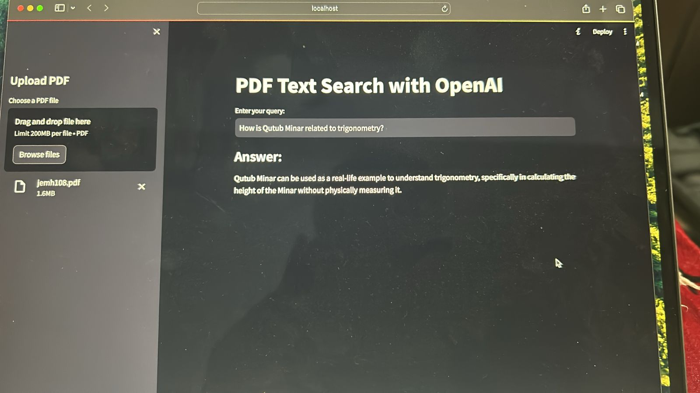

# RAG chatbot with OpenAI GPT 3.5

## Steps to use : 
1) Install all the requirements 
2) replace OPENAI_API_KEY field in config.json with your OpenAI API key
3) Run the webapp using - streamlit run webapp.py
4) If streamlit is not recognised as a command, use pip to install it or use - python3 -m streamlit run webapp.py

## Sample output

